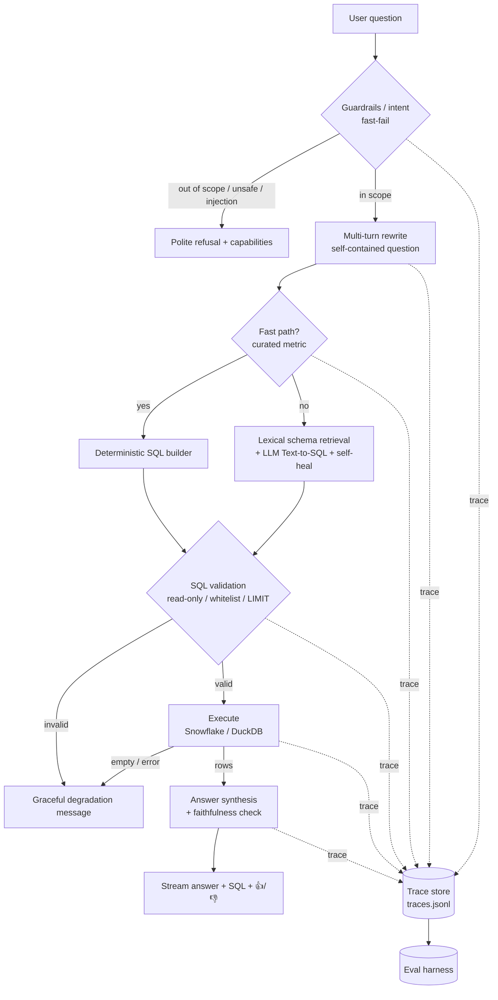
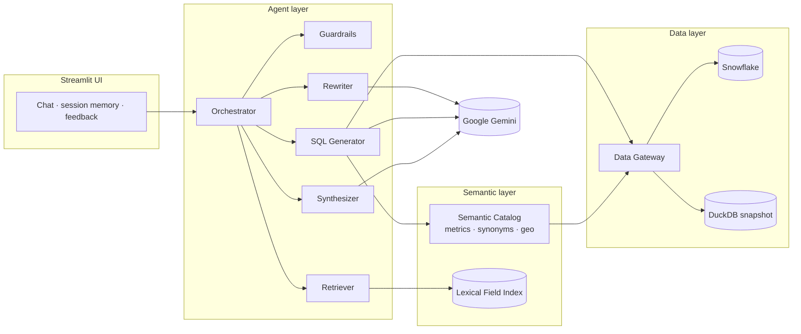

# 🇺🇸 US Population Chat Agent

> **Ask America anything. Get numbers, not guesses.**
> A production-grade, census-grounded chat agent that turns natural language into
> validated SQL over the **US Open Census** dataset (ACS 5-year, census block group granularity).

<p align="center">
  <code>Snowflake / DuckDB</code> ·
  <code>Agentic Text-to-SQL</code> ·
  <code>Google Gemini</code> ·
  <code>Eval-driven</code> ·
  <code>Streamlit Cloud</code>
</p>

---

## 🎯 TL;DR

| | |
| --- | --- |
| **What** | Multi-turn chat agent answering population/income/housing/employment questions, grounded in real census data |
| **How** | Semantic layer + schema retrieval + **Text-to-SQL** (not pure RAG) with read-only guardrails |
| **Why it stands out** | **Evaluation is a first-class deliverable** — golden dataset, faithfulness metric, failure-mode taxonomy, and a CI regression gate |
| **Built for** | Snowflake Applied AI (Forward Deployed Engineer) — judgment, trade-offs, and customer-handoff quality |

---

## 🚀 Live Demo

| | |
| --- | --- |
| **URL** | `https://<your-app>.streamlit.app` *(Streamlit Community Cloud)* |
| **Credentials** | None required — public, read-only |
| **Backend** | Live **Snowflake** Marketplace data (`DATA_BACKEND=snowflake`) |
| **Try first** | `What is the total population of California?` → then `What about Texas?` |

> Deployment guide with the exact Secrets TOML: **[`docs/DEPLOY_STREAMLIT.md`](docs/DEPLOY_STREAMLIT.md)**

---

## ✨ Highlights

- 🧠 **Agentic Text-to-SQL, not text RAG** — census data is *structured numbers*; we generate
  interpretable SQL so every answer is computed, validated, and auditable.
- 🛡️ **Multi-layer guardrails** — intent classification, prompt-injection detection, read-only
  `sqlglot` SQL validation, auto-`LIMIT`, and a **faithfulness check** (every number in the
  answer must appear in the result set).
- 📉 **Graceful degradation by design** — 7 explicit failure paths (off-topic, ambiguous geo,
  ZIP granularity, unanswerable topic, SQL/exec failure, empty result) — never a stack trace,
  never a hallucinated number.
- 📊 **Eval-driven hill-climbing** — golden dataset + failure-mode taxonomy + regression gate;
  production traces and 👍/👎 feedback flow back into evals.
- ⚡ **Fast path** — curated high-frequency metrics skip the LLM entirely (single-digit ms),
  comfortably inside the 60s SLA.
- 🔌 **Dual backend** — millisecond local **DuckDB** snapshot for dev/eval; **live Snowflake**
  on deploy. One Data Gateway interface.

---

## 🏗️ Architecture

### Request lifecycle



### Component layers



> Full design rationale, Snowflake-native comparison (Cortex Analyst / Search / Agents), and
> phase plan: **[`docs/TECHNICAL_DESIGN.md`](docs/TECHNICAL_DESIGN.md)**.

---

## 📈 Evaluation Report

Measurement is treated as part of building, not an afterthought. The harness runs the golden
dataset + degradation suite and emits per-case results and aggregate metrics
(`src/census_agent/eval/harness.py`, gated by `src/census_agent/eval/gate.py`).

### Latest deterministic run (DuckDB backend, fast path)

| Suite | Cases | Pass rate | Faithfulness | Avg latency |
| --- | --- | --- | --- | --- |
| **Golden** (`evals/golden.jsonl`) | 10 | **100%** | **100%** | ~10 ms |
| **Degradation** (`evals/phase4_degradation.jsonl`) | 8 | **100%** | — | ~6 ms |

> Deterministic fast-path metrics avoid LLM/warehouse cost and run on every commit.
> LLM Text-to-SQL cases (`requires_llm`) run separately via `scripts/verify_phase5.py` when a
> Gemini key is present.

### Quality gate thresholds (`QualityThresholds`)

| Metric | Threshold | Purpose |
| --- | --- | --- |
| Golden pass rate | ≥ 85% | Baseline correctness |
| Faithfulness rate | ≥ 90% | Anti-hallucination |
| Avg latency | ≤ 60,000 ms | Hard SLA |
| Golden passed | ≥ 8 cases | Coverage floor |
| Degradation pass rate | ≥ 75% | Failure-path robustness |

### Failure-mode taxonomy (categorize → eval → drive down)

| Failure mode | Detection | Mitigation |
| --- | --- | --- |
| Hallucination | Faithfulness check (digits ∈ results) | Force grounding; refuse when unanswerable |
| SQL generation error | `sqlglot` parse + dry-run | Validation + **one self-heal retry** + few-shot |
| Retrieval miss | recall vs golden columns | Curated measure dictionary + top-k tuning |
| Prompt injection | pattern match pre-LLM | Hard refuse, never execute |
| Wrong granularity (ZIP) | ZIP regex | Explain CBG grain; offer state/county |
| Ambiguous geo ("the South") | region patterns | Disclaim + best-effort interpretation |
| Empty / exec failure | row count / exception | Friendly message, logged trace, no stack trace |

---

## 🧩 Capabilities Matrix

| Question type | Example | Path |
| --- | --- | --- |
| Single metric | "Population of California" | ⚡ Fast path (no LLM) |
| Median / ratio | "Homeownership rate in Florida" | ⚡ Fast path |
| County | "Population of Santa Clara County" | ⚡ Fast path + FIPS join |
| Multi-turn follow-up | "What about Texas?" | 🔁 Rewriter slot inheritance |
| Open-ended field | "households with no vehicle" | 🧠 Lexical retrieval + LLM SQL |
| Unanswerable | "religion by state" | 🛡️ Graceful "not in dataset" |
| Off-topic / unsafe | "write me a poem" | 🛡️ Polite refusal |

**Curated metrics (fast path):** total population · median household income · median age ·
owner-occupied housing rate · unemployment rate · bachelor's degree rate.

---

## ⚡ Quickstart

```bash
python -m venv .venv && source .venv/bin/activate
pip install -e ".[dev]"
cp .env.example .env     # fill SNOWFLAKE_PASSWORD and GEMINI_API_KEY
```

### Option A — Local DuckDB snapshot (offline, fast, free)

```bash
python scripts/etl_snapshot.py        # Snowflake → data/census.duckdb
python scripts/build_embeddings.py 200 # lexical field index → data/field_embeddings.json
# DATA_BACKEND=duckdb in .env (default)
```

> The app **auto-selects the newest census vintage** present in the snapshot, so a 2019-only
> snapshot works even with `CENSUS_YEAR=2020` configured.

### Option B — Live Snowflake (matches deploy)

```bash
# DATA_BACKEND=snowflake in .env
streamlit run app.py
```

### Run the chat UI

```bash
streamlit run app.py        # landing page → 💬 Chat page
```

---

## ✅ Verify & Test

```bash
pytest -m "not e2e"                 # deterministic unit + integration (no model calls)
python scripts/verify_phase1.py     # semantic layer + geo resolution
python scripts/verify_phase2.py     # agent core + eval skeleton
python scripts/verify_phase3.py     # Streamlit smoke
python scripts/verify_phase4.py     # degradation + traces (+ optional Gemini E2E)
python scripts/verify_phase5.py     # tests + quality gate (+ optional Gemini E2E)
python scripts/test_gemini.py       # Gemini connectivity ping
```

**Testing strategy** — a pyramid for *deterministic* components, evals for *non-deterministic*
agent quality:

| Layer | Scope | Speed |
| --- | --- | --- |
| Unit | SQL validator, semantic mapping, geo/FIPS, guardrails, faithfulness, degradation, config | many, ms |
| Integration (E2E) | happy path + every failure path → graceful, no uncaught exceptions | few |
| Eval | end-to-end agent quality with property/structure assertions | gated |

---

## 🗂️ Project Structure

```
app.py                      # Streamlit landing page
pages/1_💬_Chat.py          # Chat interface (multi-turn, SQL expander, feedback)
ui/                         # bootstrap, theme (CSS), constants
src/census_agent/
├── agent/                  # orchestrator, rewriter, sql_builder, sql_generator,
│                           #   executor, synthesizer, degradation
├── guardrails/             # input intent, sql_validator (sqlglot), faithfulness
├── semantic/               # catalog, curated metrics, geo (FIPS) resolution
├── retrieval/              # lexical field index + schema retriever
├── data/                   # gateway + snowflake/duckdb backends
├── eval/                   # harness + quality gate
├── observability/          # trace store (traces.jsonl)
├── llm/chat.py             # Google Gemini REST client (retries, SSL)
└── config.py               # env/secrets, year auto-resolution
evals/                      # golden.jsonl + phase4_degradation.jsonl
scripts/                    # ETL, index build, verify_phaseN, connectivity probes
tests/                      # pytest suite (unit + e2e markers)
docs/                       # ASSIGNMENT, TECHNICAL_DESIGN, DEPLOY_STREAMLIT
```

---

## 🧠 Tech Choices (and why)

| Dimension | Choice | Rationale |
| --- | --- | --- |
| Approach | Custom Text-to-SQL + semantic layer | Control over guardrails / eval / degradation; aligned with Cortex Analyst semantic-model concepts for future migration |
| LLM | Google Gemini `gemini-flash-lite-latest` | Free-tier friendly; no GPU; Snowflake trial blocks Cortex `AI_COMPLETE` (err `399258`) |
| Retrieval | Lexical field index (token overlap) | Field dictionary is small → transparent, no embedding API |
| SQL safety | `sqlglot` AST validation | Reject non-SELECT / DML / multi-statement at AST level |
| Data | DuckDB (dev) + Snowflake (deploy) | Fast/free local iteration; full live data in production |
| Web | Streamlit + Community Cloud | Highest 24h ROI; built-in chat, streaming, free public URL |

---

## 📚 Documentation

- 📋 [`docs/ASSIGNMENT.md`](docs/ASSIGNMENT.md) — original homework requirements
- 🏛️ [`docs/TECHNICAL_DESIGN.md`](docs/TECHNICAL_DESIGN.md) — architecture, phases, Cortex comparison
- ☁️ [`docs/DEPLOY_STREAMLIT.md`](docs/DEPLOY_STREAMLIT.md) — cloud deploy + Secrets TOML
- 🪞 [`REFLECTION.md`](REFLECTION.md) — decisions, trade-offs, boundaries, test plan

---

## 🔐 Operations Notes

- **Secrets**: `.env` locally / Streamlit Secrets on deploy; `.gitignore` excludes `.env` & `secrets.toml`.
- **Least privilege**: read-only query path; SQL guardrails block injection & privilege escalation.
- **PAT rotation**: Snowflake token expires **2026-07-13** — rotate in Streamlit Secrets before handoff.
- **Cost/SLA**: fast path avoids LLM+warehouse spend; eval reports latency for the 60s SLA.
