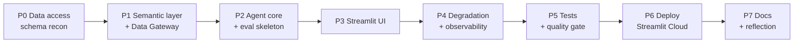

# Reflection

> Honest assessment of how this US Census chat agent was built, the trade-offs I made under a
> 24-hour constraint, the boundaries I knowingly accepted, and how I approached testing and
> evaluation. Self-awareness is the point here — not a claim of perfection.

---

## 1. Development Process

I worked in **phases with explicit acceptance criteria** so I could stop-loss at any point and
still have a coherent, demonstrable system.

**Key principle that shaped everything:** *measurement is part of building.* The eval harness
landed in Phase 2, alongside the agent core — not bolted on at the end. This let every later
change be checked against the golden dataset for regression rather than vibes.

**Where I spent the time (and where I deliberately didn't):**

| Invested heavily | Deliberately limited |
| --- | --- |
| Guardrails, graceful degradation, faithfulness | Visualizations / charts (text + table only) |
| Eval harness, golden dataset, quality gate | Vector embeddings (lexical index instead) |
| Semantic layer + curated fast-path metrics | Auth (assignment allows none; kept public) |
| Dual backend (DuckDB dev / Snowflake deploy) | Breadth of curated metrics (6 high-frequency) |

---

## 2. Key Architectural Decisions

### 2.1 Text-to-SQL, not pure RAG
Census data is structured and numeric; questions need precise aggregation, filtering, and
ranking. Pure text RAG cannot compute and will hallucinate numbers. SQL is an **interpretable,
validatable intermediate artifact** — it enables guardrails, dry-runs, and showing the user the
exact query behind every number.

### 2.2 Custom pipeline over Snowflake Cortex (with a migration path)
Cortex Analyst/Search/Agents are the native option, but my **Snowflake trial account cannot run
`AI_COMPLETE`** (verified error `399258 / 0A000`). More importantly, a custom build gave me full
control over the exact things this role evaluates: guardrails, failure-mode analysis, eval loops.
I intentionally shaped the **semantic layer to mirror Cortex Analyst semantic models**
(measures, synonyms, definitions), so "prototype custom → migrate to Cortex" is a realistic
Forward-Deployed handoff story.

### 2.3 Fast path + LLM path
Curated high-frequency metrics (population, income, age, homeownership, unemployment, education)
resolve through a **deterministic SQL builder with zero LLM calls** — single-digit milliseconds,
perfectly faithful, free. Everything else falls back to lexical retrieval + LLM Text-to-SQL with
one self-heal retry. This is the single biggest lever for the 60s SLA and for cost.

### 2.4 Lexical index over vector embeddings
The field dictionary is small and the vocabulary is narrow. Token-overlap scoring is transparent,
dependency-free, and good enough. Vectors/Cortex Search would be the upgrade path if recall
became the bottleneck — it currently isn't.

### 2.5 Dual data backend behind one Gateway
DuckDB snapshot for millisecond, zero-cost, offline dev and **repeatable evals**; live Snowflake
for the deployed app (full dataset, always current). The same read-only `DataGateway` interface
makes the swap a config flag. A small but real correctness win added late: the app
**auto-resolves the census year to the newest vintage actually present in the snapshot**, so a
2019-only local snapshot doesn't crash under a `CENSUS_YEAR=2020` config.

---

## 3. Trade-offs I Made Consciously

| Trade-off | Chose | Gave up | Why |
| --- | --- | --- | --- |
| Same small model for all roles | Simplicity, cost | Per-role tuning | One Gemini model for guardrails/rewrite/SQL/synthesis is enough at this scale |
| Rule-based intent classifier | Speed, determinism | Nuance on edge phrasing | Fast-fail beats an extra LLM round-trip for obvious off-topic input |
| Session-only memory | No persistence DB | Cross-session history | Reduces moving parts; conversation context still fully works in-session |
| Curated metric breadth (6) | Correctness on common asks | Long-tail coverage | High-frequency questions are right by construction; rest uses LLM path |
| Streamlit | 24h ROI, free URL | Custom frontend polish | Built-in chat + streaming + Community Cloud is unbeatable for the timebox |

---

## 4. Edge Cases & Failure Modes (identified, with honest status)

| Status | Failure mode | Handling today | Gap / next step |
| --- | --- | --- | --- |
| ✅ Handled | Off-topic / unsafe / prompt injection | Pattern detect → polite refuse, never execute | LLM classifier layer for nuanced phrasing |
| ✅ Handled | Unanswerable topic (religion, party) | Explicit "not in dataset" message | Broaden pattern list from real traces |
| ✅ Handled | Wrong granularity (ZIP) | Explain CBG grain, offer state/county | ZIP→CBG crosswalk for approximate answers |
| ✅ Handled | SQL invalid / exec error / empty | Validate + 1 self-heal retry + friendly message | Multi-step retry with richer error context |
| ⚠️ Partial | Ambiguous geo ("the South") | Disclaim + best-effort | Interactive clarification turn instead of assuming |
| ⚠️ Partial | Faithfulness on complex prose | Numeric grounding check | Numbers spelled as words; ratios/derived values |
| ⚠️ Partial | Multi-hop / comparative ("CA vs TX delta") | Often two turns | Native planner for multi-entity aggregation |
| ❌ Open | Margin-of-error reporting | Estimates only (`e` columns) | Surface `m` columns when precision matters |
| ❌ Open | Snowflake cold-start latency | Within SLA but variable | Warehouse keep-warm / result cache on deploy |

---

## 5. Testing & Evaluation Approach

I split correctness into two complementary regimes:

- **Deterministic components → pytest pyramid.** SQL validation, semantic mapping, geo/FIPS
  resolution, guardrails, faithfulness, degradation, and config year-resolution are unit-tested
  and run on every commit with **no model or network calls** (`pytest -m "not e2e"`).
- **Non-deterministic agent quality → eval harness.** Golden dataset + degradation suite scored
  by *property/structure* assertions (has-grounded-number, should-refuse, graceful-degradation,
  expected-failure-mode) rather than brittle exact-string matching, plus a **faithfulness rate**.
  A **quality gate** turns key metrics into pass/fail thresholds for regression protection.

**Current deterministic eval:** golden 10/10 (100%), degradation 8/8 (100%), faithfulness 100%,
avg latency ~10 ms on the fast path. LLM Text-to-SQL cases are exercised separately when a Gemini
key is present (`scripts/verify_phase5.py`).

### What I'd add to the test suite with more time
1. **recall@k retrieval eval** as a standalone metric to localize retrieval misses.
2. **Larger golden set from real traces** — close the loop: thumbs-down + failed questions →
   cleaned → regression cases (the harness and trace store already support this).
3. **LLM-as-judge** (used cautiously) for open-ended relevance, alongside deterministic checks.
4. **Cost/query tracking** per eval run for customer-ROI conversations.
5. **Cold-start / latency p95** assertions against live Snowflake, not just DuckDB.
6. **Adversarial expansion** — more injection and jailbreak variants to harden guardrail recall.

---

## 6. What I'd Do Differently With More Time

1. **Interactive clarification** for ambiguous geo/time instead of best-effort assumptions.
2. **Cortex Analyst migration** on a paid account — validate the "custom → native" handoff I
   designed the semantic layer for.
3. **Streaming synthesis** token-by-token for snappier perceived latency.
4. **Margin-of-error awareness** to communicate uncertainty honestly.
5. **Network policy hardening** — currently open for dev; scope to Streamlit Cloud egress + laptop
   before a real customer handoff.

---

## 7. Honest Bottom Line

The system is **correct where it matters most** (common questions, refusals, degradation) and
**measurable everywhere** (evals + traces + gate). I prioritized the engineering signals this
role names explicitly — define what good means, drive failure modes down, close the feedback loop
— over surface breadth. The gaps above are known, scoped, and recorded rather than hidden, which
I consider the more important signal under a 24-hour constraint.
