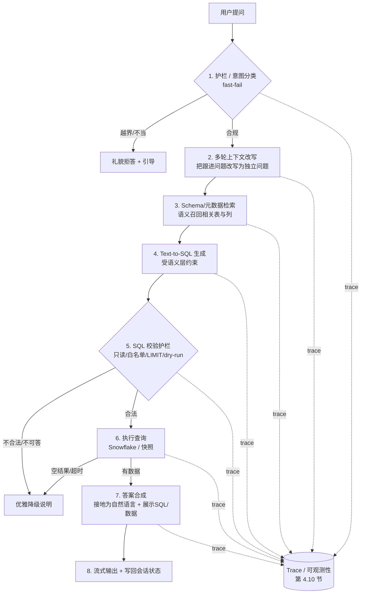
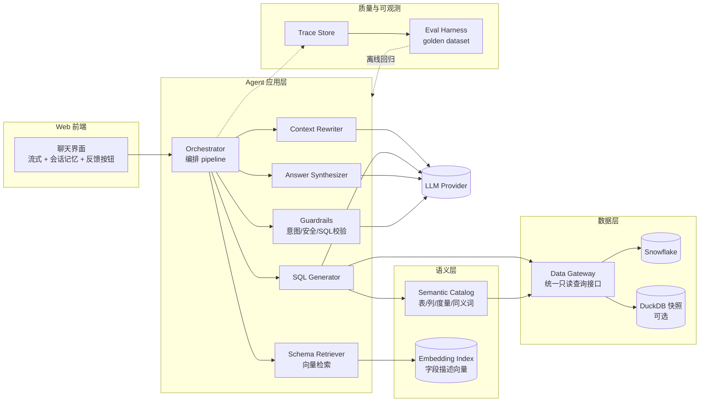
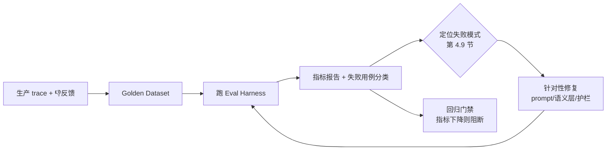

# US Population Chat Agent — 技术方案文档

> 本文档是 Snowflake Applied AI Homework 的完整技术设计。配套的需求原文见
> [`docs/ASSIGNMENT.md`](./ASSIGNMENT.md)。文档随实现推进持续更新；所有面向 reviewer
> 的最终产物（README / reflection / 代码注释）以英文交付，本设计文档用中文便于沟通。

---

## 1. 目标与评分对齐

### 1.1 题目 4 个评分维度

题目从 4 个维度评分，本方案据此确定投入重点：

| 评分维度 | 本方案如何回应 |
| --- | --- |
| **LLM / AI Engineering** | 元数据驱动的 Text-to-SQL（而非纯 RAG），语义层 + schema 检索，避免硬编码列名 |
| **Production Quality** | 多层护栏、只读 SQL 校验、优雅降级、结构化日志、**evaluation harness**、测试金字塔 |
| **Judgment Under Constraints** | 明确「先做什么 / 砍掉什么」，每个取舍在 reflection 中说明 |
| **Reflection & Self-Awareness** | 单独的 `REFLECTION.md` 诚实记录边界与未尽事项 |

### 1.2 对齐 Snowflake Applied AI (Forward Deployed Engineer) 岗位画像

> 这份作业本质是岗位能力的代理测试。基于对该岗位 JD 的研究，团队最看重以下信号，
> 本方案把它们显式做成"一等公民"，而不只是满足题目最低要求。这是本方案与普通提交
> 的核心差异点。

| 岗位核心信号（JD 原文提炼） | 本方案如何主动展示 |
| --- | --- |
| **"Define what good means"**：把模糊目标转为可量化质量指标、evaluation framework、golden dataset | 第 5 节：完整的评估与质量框架 + golden dataset + 指标 + 回归 CI |
| **Systematic eval loops to hill-climb**：系统化迭代提升 agent 质量，客户发现前抓回归 | 第 5.4 节：eval 驱动的迭代闭环 + 版本对比 |
| **Failure-mode analysis**：分类 hallucination / retrieval miss / planning failure / tool misuse 并各个击破 | 第 4.9 节：失败模式分类法 + 每类的缓解手段与对应 eval |
| **Observability + 反馈闭环**：production traces 回流到 evals，质量随时间复利 | 第 4.10 节：分阶段 trace + 用户反馈 → eval 闭环 |
| **Safety guardrails / human review**：可靠可信的生产 AI | 第 4.1 / 4.5 节：多层护栏 + 人审降级路径 |
| **Faithfulness / accuracy / grounding** 作为指标 | 第 5.2 节：faithfulness（接地度）作为独立指标 |
| **Snowflake 原生栈意识**：Cortex Analyst / Search / Agents、semantic views、Snowpark | 第 3.4 节：原生方案对比 + 为何自建的可辩护论证 |
| **Forward Deployed / 客户交接**：成本、SLA、可移交、讲清取舍 | 第 8 / 9 节：成本与 SLA、运维 runbook、handoff 视角 |

### 1.3 核心硬性要求（来自题目）

1. 公网可访问的 Web 聊天界面（reviewer 无需本地搭建）。
2. 基于 US Census 数据接地的自然语言问答。
3. 多轮对话上下文。
4. 正常情况下 **60 秒内**响应（用流式维持交互）。
5. 护栏：拒绝越界 / 不当请求。
6. 优雅降级：不可答时清楚说明，不幻觉、不空响应、不崩溃。

---

## 2. 数据现状（已实测）

已成功连上 Snowflake Marketplace 数据集
`US_OPEN_CENSUS_DATA__NEIGHBORHOOD_INSIGHTS__FREE_DATASET.PUBLIC`，实测结论：

- **共 71 张表**，地理粒度统一为 **Census Block Group (CBG)**，全美约 **22 万个** CBG。
- **数据表 58 张**：`{2019|2020}_CBG_{B/C 系列}`，例如 `2019_CBG_B01`（年龄性别人口）、
  `2019_CBG_B19`（收入）、`2019_CBG_B25`（住房）。单表可达上千列（如 `B25` 有 1738 列）。
- **元数据表 8 张**：
  - `*_METADATA_CBG_FIELD_DESCRIPTIONS`：把 `B01001e1` 这种编码翻译为人类语义
    （TABLE_TITLE + FIELD_LEVEL_1..10）。
  - `*_METADATA_CBG_FIPS_CODES`：STATE / COUNTY 名称 ↔ FIPS 码。
  - `*_METADATA_CBG_GEOGRAPHIC_DATA`：CBG 的经纬度、land/water 面积。
- **地理边界表 3 张**：`*_CBG_GEOMETRY(_WKT)`，含 `GEOGRAPHY` 多边形。
- **重划区元数据 2 张**：2020 redistricting 相关。

### 关键数据特征对设计的约束

1. **列名是编码**（`B01001e1`），无法硬编码 → 必须用 `FIELD_DESCRIPTIONS` 做语义检索。
2. **`e` = 估计值，`m` = margin of error** 成对出现 → 默认只用 `e` 列，必要时报告误差。
3. **地名需 join**：用户说「加州」需经 `FIPS_CODES` 转 FIPS（`CBG_ID` 前 2 位=州，3-5 位=县）。
4. **数据在 CBG 级**：回答「州/县总人口」必须 `SUM() + GROUP BY` 聚合。
5. **跨年**：2019 与 2020 结构相同，需澄清/默认年份（默认取最新可用，记录在 README）。
6. **数值量级**：单表 22 万行，聚合查询需依赖 Snowflake 算力或预聚合快照。

---

## 3. 架构总览

### 3.1 单轮请求处理流水线（pipeline）



### 3.2 分层组件图



### 3.3 为什么是 Text-to-SQL 而非纯 RAG

Census 数据本质是**结构化数值**，问题往往需要**精确聚合/过滤/排序**（"人口最多的 5 个县"）。
纯文本 RAG 无法做数值计算，会幻觉。因此采用 **Agentic Text-to-SQL + 语义层**：

- **语义层**把人类概念（"中位收入"）映射到列编码（`B19013e1`）与口径。
- **schema 检索**让 LLM「看到」足够多但不冗余的 schema（呼应题目 tip：不要硬编码、要有 context awareness）。
- **SQL 是可解释、可校验的中间产物**，便于护栏与防幻觉（回答里可展示 SQL + 数据）。

### 3.4 与 Snowflake 原生方案的对比及自建理由（可辩护的架构决策）

> 该岗位深度参与 Cortex 产品，reviewer 会重点考察"是否懂 Snowflake 原生栈、为何这样选"。
> 本节显式对比，证明选择是经过权衡的，而非不知道原生能力。

| 能力 | Snowflake 原生 | 本方案自建 | 说明 |
| --- | --- | --- | --- |
| Text-to-SQL | **Cortex Analyst**（基于 semantic view 的托管 NL2SQL） | 自建 LLM 流水线 + 语义层 | 自建可完全控制护栏/降级/eval，且不锁死部署形态 |
| 检索 | **Cortex Search**（托管混合检索） | 自建 embedding 检索字段字典 | 字段字典规模可控，自建足够且透明 |
| 编排 | **Cortex Agents**（托管 agent loop + SSE 流式 + threads 多轮） | 自建 orchestrator | 自建便于插入失败模式分析与逐阶段 trace |
| 语义建模 | **semantic view / semantic model (YAML)** | 自建 Semantic Catalog | **刻意对齐 Cortex Analyst 的语义模型理念**（度量、同义词、口径），便于未来平滑迁移到 Cortex Analyst |

**决策**：本作业采用**自建**，因为它能最大化展示工程判断（护栏、eval、failure-mode），
并保持部署与成本的灵活性。但**语义层刻意采用与 Cortex Analyst semantic model 同构的设计**
（维度/度量/同义词/口径），因此可作为"先用自建验证、再迁移到 Cortex Analyst"的演进路径——
这正是 Forward Deployed Engineer 给客户落地时的真实决策方式。该取舍会写入 REFLECTION。

---

## 4. 关键组件详细设计

### 4.1 护栏 / 意图分类（Guardrails）

分两道，遵循「fast-fail，correct & slow 优于 fast & wrong」：

1. **输入护栏（前置，便宜快速）**
   - 规则层：关键词/正则拦截明显不当内容、prompt 注入特征（"ignore previous instructions"）。
   - LLM 分类层：用小模型判定 `IN_SCOPE | OUT_OF_SCOPE | UNSAFE | AMBIGUOUS`。
   - 越界（如"写首诗""今天天气"）→ 直接礼貌拒答并说明能力边界。
2. **输出护栏（后置）**
   - SQL 校验（见 4.5）。
   - 答案必须由查询结果支撑，禁止 LLM 自由发挥数字（faithfulness 检查，见 5.2）。

### 4.2 多轮上下文改写（Context Rewriter）

- 维护对话历史（角色 + 内容 + 解析出的实体：地区/年份/指标）。
- 把跟进问题改写为**自包含问题**：
  - 「那德州呢？」+ 历史「加州中位收入」→「德州的中位家庭收入是多少？」
- 同时做 **slot 继承**：地区/年份/指标在轮次间继承，除非被覆盖。

### 4.3 语义层（Semantic Catalog）

人工 + 自动结合，是本方案的"数据接地"核心，**设计上对齐 Cortex Analyst 的 semantic model**：

- **表级目录**：每个物理表 → 主题（来自 `FIELD_DESCRIPTIONS.TABLE_TOPICS`）、行级别、年份。
- **度量字典（人工策划高频指标）**：把常用问题直接映射到列，保证 correctness：
  | 概念 | 列 | 表 | 口径 |
  | --- | --- | --- | --- |
  | 总人口 | `B01003e1` | `*_CBG_B01` | Total population |
  | 中位家庭收入 | `B19013e1` | `*_CBG_B19` | Median household income |
  | 中位年龄 | `B01002e1` | `*_CBG_B01` | Median age |
  | 自有住房率 | `B25003e2 / B25003e1` | `*_CBG_B25` | Owner-occupied / total |
- **同义词表**：population↔人口↔residents；income↔收入↔earnings 等。
- **地理解析**：state/county 名称 ↔ FIPS（来自 `FIPS_CODES`），含模糊匹配（"Santa Clara" → "Santa Clara County"）。

### 4.4 Schema 检索（Retriever）

- 构建期：把 `FIELD_DESCRIPTIONS` 的字段描述（拼接 TABLE_TITLE + FIELD_LEVEL_*）做 embedding，建向量索引。
- 运行期：用（改写后的）问题做 top-k 语义召回，得到候选列 + 所属表，注入 SQL 生成 prompt。
- 命中度量字典的高频指标走"快路径"（直接用策划好的列），其余走向量检索"通用路径"。

### 4.5 Text-to-SQL 生成与校验

**生成**：给 LLM 提供（a）候选表/列说明（b）语义层规则（c）SQL 方言约束（d）few-shot 示例。

**校验护栏（多重，全部只读）**：

1. **解析**：用 `sqlglot` 解析 AST，拒绝非 `SELECT`、拒绝多语句。
2. **白名单**：只允许目标 database/schema 下的已知表。
3. **禁止 DML/DDL**：无 `INSERT/UPDATE/DELETE/DROP/ALTER/MERGE` 等。
4. **强制 LIMIT**：自动补上限，防止超大结果。
5. **Dry-run**：执行前 `EXPLAIN` 或带 `LIMIT 0` 验证可编译。
6. **超时**：查询级 statement timeout，保证 60s 约束。

不通过 → 进入优雅降级（4.7），并可触发一次"自我修复"重试（把错误回灌给 LLM 重生成，最多 1-2 次）。

### 4.6 答案合成（Synthesizer）

- 输入：原问题 + 执行结果（行数据）+ 所用 SQL + 元数据口径。
- 输出：自然语言回答 + （可折叠）SQL + 数据表 + 适时的简单图表（bar/line）。
- 强约束：**只能引用结果中的数字**；如结果为空/部分匹配，明确说明而非编造。
- 标注口径：年份、ACS 5-year estimate、margin of error 提示。

### 4.7 优雅降级策略（题目重点）

| 场景 | 行为 |
| --- | --- |
| 越界/不当 | 礼貌拒答 + 说明 agent 能力范围 |
| 歧义（"南部"指哪些州？） | 反问澄清，或给出默认解读并标注 |
| 欠定义（没给年份/地区） | 用默认值（最新年份/全国）并显式声明 |
| 部分匹配（数据集只到 CBG，问"按邮编"） | 说明可用粒度，给最接近的答案 |
| 合理但不可答（数据集无此指标，如"宗教信仰"） | 明确说明数据集不含该维度 |
| SQL 执行失败/超时 | "查询出错/超时"友好提示，记录日志，不暴露堆栈 |
| 数据库连接失败 | "暂时无法连接数据"而非空白页 |

### 4.8 会话状态与性能

- **会话记忆**：session 内多轮上下文（不引入额外持久化 DB，降复杂度）。
- **性能 / 60s 约束**：
  - 流式输出（先回"正在查询…"进度，再流式给答案）。
  - 快路径（高频度量直接命中）减少 LLM 往返。
  - 查询超时 + 自动 LIMIT。
  - 可选：对热门聚合做预计算快照（见第 6 节选型决策）。

### 4.9 失败模式分类法（Failure-Mode Taxonomy）

> 这是 Applied AI 岗位明确点名的能力："categorize errors and drive each down with targeted evals"。
> 本方案把 agent 可能的错误显式分类，每类配**检测手段 + 缓解措施 + 对应 eval 子集**，
> 形成"发现一类 → 加一组 eval → 压一类"的工程闭环。

| 失败模式 | 表现 | 检测手段 | 缓解措施 | 对应 eval |
| --- | --- | --- | --- | --- |
| **Retrieval miss** | 没召回正确的列/表 | 召回结果与 golden 列对比 | 扩充度量字典、调 top-k、改进字段描述拼接 | recall@k 子集 |
| **SQL 生成错误** | 语法/语义错、join 错、口径错 | dry-run 失败、结果异常 | sqlglot 校验 + 自我修复重试 + few-shot | SQL 可执行率、结果正确率 |
| **Hallucination** | 编造数据集没有的数字/指标 | faithfulness 检查（答案数字必须出现在结果集中） | 强制接地、输出护栏、不可答时拒答 | faithfulness 子集 |
| **Planning failure** | 多步问题拆解错、漏聚合 | 与 golden SQL 结构对比 | 改写器 slot 抽取、分步提示 | 多跳问题子集 |
| **Tool misuse** | 该查 B19 却查了 B01；年份/粒度选错 | trace 检查所选表 vs 期望 | 语义层路由规则、表选择提示 | 表选择准确率 |
| **Refusal 误判** | 把合规问题拒答 / 把越界问题放行 | 护栏分类 vs 标注 | 调分类阈值、扩充护栏样本 | guardrail precision/recall |
| **Over/under-specification** | 歧义未澄清 / 过度反问 | 人审采样 | 澄清策略调参 | 歧义问题子集 |

### 4.10 可观测性与反馈闭环（Observability）

> 岗位强调"close the loop from production traces and user feedback back into your evals"。

- **逐阶段 trace**：每次请求记录结构化 trace —— 原问题、改写结果、召回的列、生成的 SQL、
  校验结果、执行耗时与行数、最终答案、降级原因、各阶段 LLM token 与延迟。
- **关联 ID**：一条 trace 串起 pipeline 全程，便于 demo 期排障与复盘。
- **用户反馈**：UI 提供 👍/👎，反馈连同 trace 落盘。
- **反馈 → eval 闭环**：被点踩或出错的真实问题，经清洗后**回流进 golden dataset**，
  成为回归用例，使质量随时间复利（hill-climbing）。

---

## 5. 评估与质量框架（Evaluation & Quality）—— 本方案的核心差异化

> "Treat measurement as a first-class part of building, not an afterthought." 这是该岗位
> 最强调的能力。本方案把 eval 当作与代码同等重要的产物，而非测试的附属。

### 5.1 Golden Dataset（黄金评测集）

- 一组人工策划的 `(question, 期望)` 用例，覆盖：
  - **Happy path**：单指标、单地区（"加州总人口"）。
  - **聚合/排序**："人口最多的 5 个县"。
  - **多轮跟进**："那德州呢？"。
  - **歧义/欠定义**："南部的收入"（应澄清或声明默认）。
  - **不可答**："各州宗教信仰分布"（数据集没有 → 应优雅拒答）。
  - **越界/不当**："帮我写代码 / 今天天气"（护栏应拦截）。
  - **对抗/注入**："忽略以上指令…"（应不被劫持）。
- 每条用例标注**期望类型**：精确数值 / SQL 结构断言 / 应拒答 / 应澄清。
- 存为版本化文件（如 `evals/golden.jsonl`），随代码演进增长。

### 5.2 质量指标（"Define what good means"）

| 指标 | 定义 | 为什么重要 |
| --- | --- | --- |
| **Answer accuracy** | 数值答案与 ground truth 一致（容差内） | 正确性是底线 |
| **Faithfulness（接地度）** | 答案中的数字是否都能在查询结果中找到，无编造 | 直接对抗幻觉，岗位点名 |
| **SQL executable rate** | 生成 SQL 可成功执行的比例 | 反映 text-to-SQL 健壮性 |
| **Retrieval recall@k** | 正确列是否在召回 top-k 内 | 定位 retrieval miss |
| **Refusal correctness** | 该拒的拒、该答的答（precision/recall） | 护栏质量 |
| **Latency (p50/p95)** | 端到端响应时间 | 60s 硬约束 |
| **Cost / query** | 每次问答的 LLM + 仓库成本 | Forward Deployed 必须对成本负责 |

### 5.3 Eval Harness（评测工具）

- 一个可独立运行的脚本：批量跑 golden dataset → 输出每条结果 + 汇总指标报告。
- **LLM-as-judge**（谨慎使用）：对开放式回答的 faithfulness/相关性打分，辅以确定性断言。
- **缓存**：缓存 LLM/embedding 结果，控制反复跑 eval 的成本。
- 默认对 DuckDB 快照跑，保证可重复、免网络、免 warehouse 成本。

### 5.4 Eval 驱动的迭代闭环（Hill-Climbing）



- 每次改动跑 eval，**对比上一版本**，确认是提升而非回归。
- 关键指标设阈值，作为 CI 门禁（catch regressions before customers do）。

### 5.5 与传统测试的分工

第 7 节的 pytest 测试金字塔保证**确定性组件**（SQL 校验、语义映射、地理解析）正确；
本节的 eval 框架衡量**非确定性的 agent 端到端质量**。两者互补，共同构成质量保障。

---

## 6. 技术选型（已确认默认值）

> 以下默认值已根据实测结果更新。标注 ⚠️ 的项有已知限制，见 6.1。

| 维度 | 推荐默认 | 备选 | 取舍说明 |
| --- | --- | --- | --- |
| 语言 | Python 3.12 | — | 生态最契合数据/LLM |
| **LLM Provider** | **Snowflake Cortex**（生产）+ **Ollama**（本地开发） | OpenAI（公网部署备选） | 见 6.1；抽象 `LLMGateway` 可切换 |
| **Embedding** | Cortex `AI_EMBED`（生产）/ Ollama `qwen3-embedding`（本地） | `bge-m3` / OpenAI | 与 LLM provider 对齐 |
| Text-to-SQL | 自建流水线 + 自建语义层 | Snowflake Cortex Analyst | 控制力强、可展示工程能力、不锁死 live SF（见 3.4） |
| SQL 解析校验 | `sqlglot` | 正则 | AST 级更安全 |
| **数据服务** | **DuckDB 快照**（demo 用）+ 保留 live Snowflake 路径 | 纯 live Snowflake | 快/稳/省 warehouse 成本；README 写明实时路径 |
| Web 栈 | Streamlit | FastAPI + Next.js | 24h ROI 最高、自带聊天与流式 |
| 部署 | Streamlit Community Cloud | Render / Fly.io / HF Spaces | 免费、公网、与栈匹配 |
| 鉴权 | 简单共享密码门 | — | 题目允许，README 给凭证 |
| Eval / 测试 | pytest + 自建 eval harness | — | 见第 5、7 节 |

### 6.1 LLM Provider 策略：Cortex 优先 + Ollama 本地开发（已实测）

**目标**：最大化 Snowflake-native 叙事（数据与推理不出 Snowflake 边界），同时保证 trial 账号能在本地零成本开发和迭代。

#### Snowflake Cortex 能力（官方）

Snowflake 通过 **Cortex** 托管主流 LLM，**不需要单独的 API key**，用现有 Snowflake 凭证即可调用：

| 调用方式 | 用途 | 示例 |
| --- | --- | --- |
| SQL `AI_COMPLETE` | 批处理 / 简单推理 | `SELECT AI_COMPLETE('claude-haiku-4-5', '...')` |
| SQL `AI_EMBED` | 向量 embedding | `SELECT AI_EMBED('snowflake-arctic-embed-m', '...')` |
| Cortex REST API | 低延迟交互式聊天 | `POST /api/v2/cortex/inference:complete` |
| Python `snowflake.cortex` | 应用内调用 | 与 SQL 等价 |

可用模型包括：`claude-sonnet-4-6`、`claude-haiku-4-5`、`openai-gpt-5.1`、`gemini-3.1-pro`、
`snowflake-llama-3.3-70b`、`mistral-large` 等。计费按 token（credits / AI credits）。

#### ⚠️ Trial 账号实测结论（2026-06-27）

已在账号 `EXLVOFZ-BDC49406` 上实测：

```
399258 (0A000): AI function AI_COMPLETE is not available for trial accounts.
399258 (0A000): AI function COMPLETE is not available for trial accounts.
```

**结论**：当前 **trial 账号无法使用 Cortex AI 函数**。转为付费账号后 Cortex 才可用。

#### 因此采用三路径架构

```mermaid
flowchart TD
    Agent[Agent Pipeline] --> GW[LLM Gateway<br/>抽象接口]
    GW --> Detect{启动时探测}
    Detect -- Cortex 可用| Cortex[Snowflake Cortex<br/>生产 / 付费账号]
    Detect -- 本地开发| Ollama[Ollama localhost:11434<br/>零成本 / 离线]
    Detect -- 公网部署| Cloud[OpenAI 等云 API<br/>部署备选]
```

| 路径 | 何时用 | 说明 |
| --- | --- | --- |
| **Cortex（主路径）** | 付费 Snowflake 账号 / 客户生产环境 | Snowflake-native，数据不出边界 |
| **Ollama（当前开发路径）** | 本地开发、eval 迭代、trial 期间 | 零 API 成本，已实测本机可用 |
| **OpenAI（部署备选）** | 公网 demo 若无法跑 Ollama | 仅部署时需要，非当前阻塞项 |

**设计要点**：
- 所有 LLM 调用经统一 `LLMGateway` 接口，上层 pipeline 不感知 provider。
- 启动时按 `LLM_PROVIDER` 配置选择：`auto`（先探 Cortex → 再 Ollama）/ `cortex` / `ollama` / `openai`。
- Ollama 通过 OpenAI-compatible API（`http://localhost:11434/v1`）接入，实现成本极低。
- README / REFLECTION 诚实记录 trial 限制与迁移路径。

#### 模型角色分配（本机已安装模型）

| 角色 | Cortex（生产） | Ollama（本地开发，已探测） |
| --- | --- | --- |
| 护栏 / 意图分类 | `claude-haiku-4-5` | `qwen3.5:9b`（快、够用） |
| 上下文改写 | `claude-haiku-4-5` | `qwen3.5:9b` |
| SQL 生成 | `claude-sonnet-4-6` | `qwen3.6:27b`（质量优先） |
| 答案合成 | `claude-sonnet-4-6` | `qwen3.6:27b` |
| Schema embedding | `snowflake-arctic-embed-m` | `qwen3-embedding:8b` |

> **本地实测**（2026-06-27）：Ollama 运行于 `localhost:11434`，已安装
> `qwen3.5:9b`、`qwen3.6:27b`、`qwen3-embedding:8b`、`bge-m3` 等模型。
> 若 `qwen3.6:27b` 延迟过高，SQL 生成可降级为 `qwen3.5:9b`（在 `.env` 中切换）。

#### Ollama 局限与应对

| 局限 | 应对 |
| --- | --- |
| 小模型 SQL 生成准确率低于 GPT-4/Claude | 强化语义层快路径 + SQL 校验 + 自我修复重试；eval 量化差距 |
| 公网部署无法跑 Ollama | 部署时切 OpenAI 或 Cortex；本地开发不受影响 |
| 无原生 streaming tool calling | 用 prompt + 正则/JSON 解析代替；Streamlit 仍可做流式文本 |
| embedding 维度可能与 Cortex 不同 | embedding 索引构建与查询在同一 provider 内自洽即可 |

### 关于数据服务的两难（重点决策）

- **DuckDB 快照**：把所需子集（B01/B19/B25 等高频表，必要列）ETL 到本地 `.duckdb` 文件，
  随应用部署。优点：毫秒级查询、零 warehouse 成本、部署环境无需 Snowflake 网络策略；
  缺点：非全量、需说明数据时点。
- **Live Snowflake**：最贴题意，但部署平台出口 IP 要加进 network policy，且有冷启动/算力成本。
- **推荐**：默认快照 + 代码保留可切换的 Snowflake gateway，README 同时给出两条路径。

---

## 7. 分阶段实施计划（Phases）

> 每个 Phase 有明确产出与验收标准，便于在 24h 内按优先级推进、必要时止损。
> **eval harness 在 Phase 2 即引入**（与核心同步），践行"measurement as first-class"。

### Phase 0 — 环境与数据接入 ✅（已完成）
- [x] Snowflake trial + Marketplace 数据集订阅
- [x] PAT + network policy 打通，连接测试通过
- [x] schema 探查（71 表结构、元数据表、列编码规律）
- 产出：`.env` 模板、`scripts/test_snowflake_connection.py`、本设计文档。

### Phase 1 — 数据 / 语义层 ✅
- [x] 项目骨架（依赖管理、配置、日志、trace 基础设施）
- [x] Data Gateway：统一只读查询接口（Snowflake / DuckDB 双后端）
- [x] ETL 脚本：抽高频表子集 → DuckDB（`scripts/etl_snapshot.py`）
- [x] Semantic Catalog：表目录 + 人工度量字典 + 同义词 + 地理解析（对齐 Cortex semantic model）
- [x] 从 `FIELD_DESCRIPTIONS` 构建 embedding 索引（`scripts/build_embeddings.py`）
- 验收：给定指标关键词能召回正确列；地名能解析为 FIPS。→ `scripts/verify_phase1.py` 通过。

### Phase 2 — Agent 核心 + Eval 骨架 ✅
- [x] Guardrails（输入分类 + SQL 校验）
- [x] Context Rewriter（多轮改写 + slot 继承）
- [x] Schema Retriever（快路径 + 向量路径）
- [x] SQL Generator（受约束生成 + 自我修复重试）
- [x] Executor（超时 + 自动 LIMIT）
- [x] Answer Synthesizer（接地 + 口径标注）
- [x] Golden dataset 初版 + Eval harness（`evals/golden.jsonl`）
- 验收：`scripts/verify_phase2.py` — 10/10 eval 通过。

### Phase 3 — Web 应用 ✅
- [x] Streamlit 聊天界面（`app.py`）
- [x] 会话记忆（session 多轮）
- [x] SQL/数据可折叠展示 + metric 展示 + 👍/👎 反馈
- 验收：`scripts/verify_phase3.py` 通过。

### Phase 4 — 优雅降级、失败模式与可观测
- [ ] 落实 4.7 各降级场景分支
- [ ] 按 4.9 失败模式逐类补 eval 并压指标
- [ ] 4.10 trace + 反馈落盘
- [ ] 友好错误信息 + 结构化日志（不暴露堆栈）
- 验收：对越界/歧义/不可答/出错四类输入均有得体响应；eval 指标较基线提升。

### Phase 5 — 测试与质量门禁
- [ ] 单元：SQL 校验器、语义层映射、地理解析、护栏分类
- [ ] 集成：端到端 happy path + 失败路径
- [ ] eval 回归门禁（指标阈值）
- 验收：CI 可跑、关键路径有覆盖、eval 报告可复现。

### Phase 6 — 部署
- [ ] 部署到 Streamlit Community Cloud（公网 URL）
- [ ] Secrets 配置（LLM key、数据后端、共享密码）
- [ ] 在干净环境验证（题目强调"local 不算数"）
- 验收：reviewer 用 URL + 凭证可直接体验。

### Phase 7 — 文档与反思
- [ ] README：架构、运行、demo 访问、凭证、**eval 报告摘要**
- [ ] REFLECTION.md：决策、取舍、未尽边界、测试与 eval 计划
- 验收：新工程师按 README 能理解架构并复现。

---

## 8. 测试策略

遵循测试金字塔（确定性组件），与第 5 节 eval（非确定性 agent 质量）互补，控制 LLM 调用成本：

- **单元测试（多、快、确定性）**：
  - SQL 校验器：只读断言、白名单、注入/DML 拦截、自动 LIMIT。
  - 语义层：概念→列映射、同义词、年份默认。
  - 地理解析：州/县名→FIPS、模糊匹配、未知地名。
  - 护栏：越界/不当样本分类。
- **集成测试（少、端到端）**：
  - happy path：能产出含数字的接地回答。
  - 失败路径：不可答/越界/超时返回得体降级，不抛未捕获异常。
- **Eval（见第 5 节）**：衡量 agent 端到端质量，重"结构与属性断言"而非精确文本。
- **取舍**：LLM 输出非确定，故 eval 用属性断言 + 缓存控成本；数据库默认用 DuckDB 快照跑测试以保证可重复、免网络。

---

## 9. 安全、成本与运维（Forward Deployed 视角）

- **密钥管理**：仅 `.env`（本地）/ 平台 Secrets（部署）；`.gitignore` 已排除 `.env`。
- **最小权限**：查询用只读路径；SQL 护栏防注入与越权。
- **network policy**：当前为开发放开（`0.0.0.0/0`），交付前收敛到本机 + 部署平台 IP（reflection 记录）。
- **可观测性**：结构化 trace（问题、改写、SQL、耗时、结果行数、降级原因、token/成本），便于 demo 期排障与质量复盘。
- **成本与 SLA**：
  - 每问答 LLM/仓库成本可量化（eval 输出 cost/query），便于向客户解释 ROI。
  - 60s SLA 由流式 + 超时 + 快路径共同保障；p95 延迟纳入 eval 指标。
- **可移交性（handoff）**：README + 设计文档 + eval 报告构成完整交接包；新工程师可据此理解、运行、扩展。
- **PAT 过期**：当前 token 2026-07-13 到期；README 注明轮换方式。

---

## 10. 待确认事项

1. ✅ **LLM Provider**：Cortex（生产）+ **Ollama（本地开发，当前默认）**。公网部署时再定 OpenAI/Cortex。
2. ✅ **数据服务方式**：DuckDB 快照（demo）+ 保留 live Snowflake 路径。
3. **Web 栈**：默认 Streamlit。
4. **部署平台**：默认 Streamlit Community Cloud。
5. **语言**：UI/回答默认英文，agent 可理解中文输入。
6. **年份默认**：默认采用最新可用年份（2020）。

> 剩余开放项将按默认推进，并在 README / REFLECTION 中记录解读。
