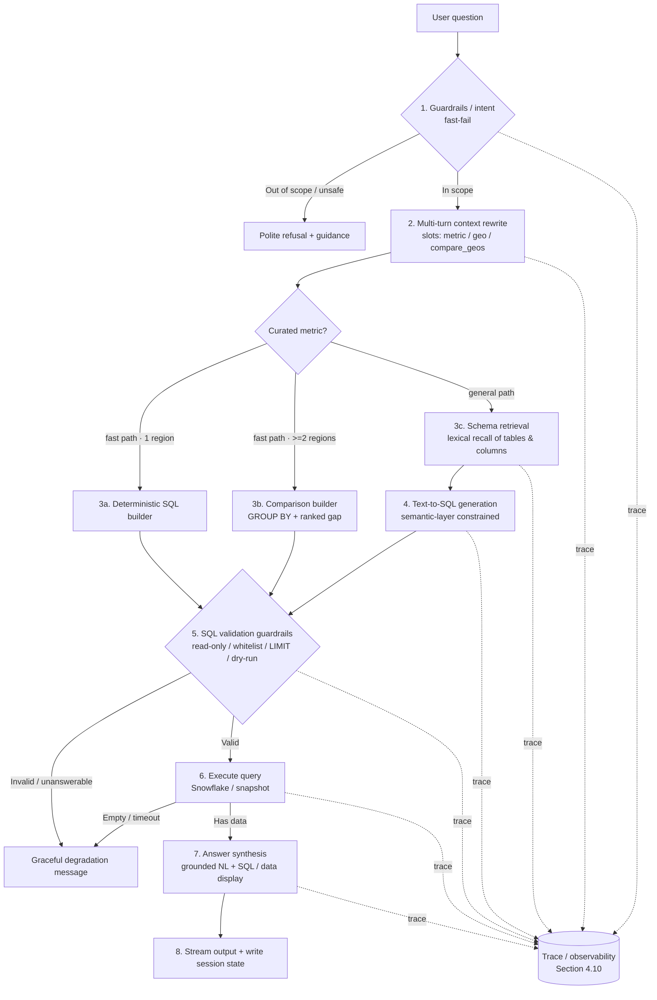
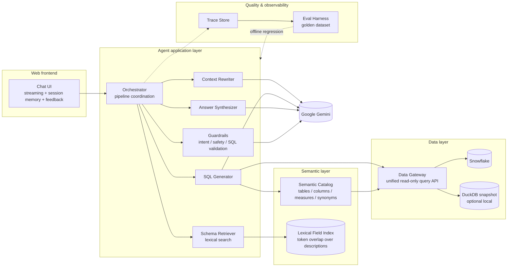
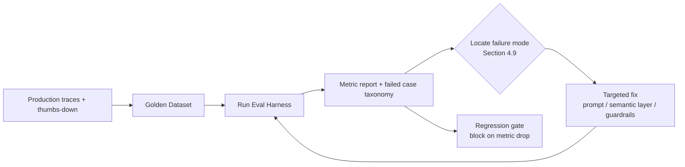
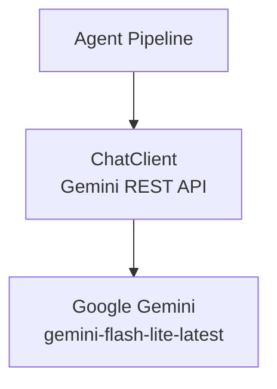

# US Population Chat Agent — Technical Design

> This document is the complete technical design for the Snowflake Applied AI homework.
> The original assignment requirements are in [`docs/ASSIGNMENT.md`](./ASSIGNMENT.md).
> The document is updated as implementation progresses. All reviewer-facing deliverables
> (README, reflection, code comments) are in English.

---

## 1. Goals and Rubric Alignment

### 1.1 Four Scoring Dimensions

The assignment is scored on four dimensions; this design allocates effort accordingly:

| Scoring dimension | How this design addresses it |
| --- | --- |
| **LLM / AI Engineering** | Metadata-driven Text-to-SQL (not pure RAG), semantic layer + schema retrieval, no hard-coded column names |
| **Production Quality** | Multi-layer guardrails, read-only SQL validation, graceful degradation, structured logging, **evaluation harness**, test pyramid |
| **Judgment Under Constraints** | Explicit prioritization (what to build first / what to cut), with trade-offs documented in reflection |
| **Reflection & Self-Awareness** | A dedicated `REFLECTION.md` honestly records boundaries and open items |

### 1.2 Alignment with Snowflake Applied AI (Forward Deployed Engineer) Role

> This homework is effectively a proxy test for the role. Based on research into the job
> description, the team cares most about the signals below. This design makes them
> first-class concerns—not just minimum requirements. That is the core differentiator
> versus a typical submission.

| Core role signal (from JD) | How this design demonstrates it |
| --- | --- |
| **"Define what good means"**: turn fuzzy goals into measurable quality metrics, evaluation framework, golden dataset | Section 5: full evaluation & quality framework + golden dataset + metrics + regression CI |
| **Systematic eval loops to hill-climb**: iterate agent quality systematically; catch regressions before customers do | Section 5.4: eval-driven iteration loop + version comparison |
| **Failure-mode analysis**: categorize hallucination / retrieval miss / planning failure / tool misuse and drive each down | Section 4.9: failure-mode taxonomy + mitigations + matching evals |
| **Observability + feedback loop**: production traces feed back into evals; quality compounds over time | Section 4.10: per-stage traces + user feedback → eval loop |
| **Safety guardrails / human review**: reliable, trustworthy production AI | Sections 4.1 / 4.5: multi-layer guardrails + human-review fallback path |
| **Faithfulness / accuracy / grounding** as metrics | Section 5.2: faithfulness (grounding) as a standalone metric |
| **Snowflake-native stack awareness**: Cortex Analyst / Search / Agents, semantic views, Snowpark | Section 3.4: native-option comparison + defensible rationale for custom build |
| **Forward Deployed / customer handoff**: cost, SLA, transferability, clear trade-off narrative | Sections 8 / 9: cost & SLA, ops runbook, handoff perspective |

### 1.3 Core Hard Requirements (from the assignment)

1. Publicly accessible web chat UI (reviewer does not need local setup).
2. Natural-language Q&A grounded in US Census data.
3. Multi-turn conversational context.
4. **Under 60 seconds** response time in normal cases (streaming maintains interactivity).
5. Guardrails: refuse out-of-scope / inappropriate requests.
6. Graceful degradation: when unanswerable, explain clearly—no hallucination, no empty response, no crash.

---

## 2. Data Landscape (Verified)

Successfully connected to the Snowflake Marketplace dataset
`US_OPEN_CENSUS_DATA__NEIGHBORHOOD_INSIGHTS__FREE_DATASET.PUBLIC`. Verified findings:

- **71 tables total**, all at **Census Block Group (CBG)** geography—roughly **220,000** CBGs nationwide.
- **58 data tables**: `{2019|2020}_CBG_{B/C series}`, e.g. `2019_CBG_B01` (age/sex population),
  `2019_CBG_B19` (income), `2019_CBG_B25` (housing). A single table can have thousands of columns
  (e.g. `B25` has 1,738 columns).
- **8 metadata tables**:
  - `*_METADATA_CBG_FIELD_DESCRIPTIONS`: translates codes like `B01001e1` into human semantics
    (TABLE_TITLE + FIELD_LEVEL_1..10).
  - `*_METADATA_CBG_FIPS_CODES`: STATE / COUNTY name ↔ FIPS code.
  - `*_METADATA_CBG_GEOGRAPHIC_DATA`: CBG lat/lon, land/water area.
- **3 geography boundary tables**: `*_CBG_GEOMETRY(_WKT)`, containing `GEOGRAPHY` polygons.
- **2 redistricting metadata tables**: 2020 redistricting related.

### Key Data Characteristics That Constrain Design

1. **Column names are codes** (`B01001e1`)—cannot hard-code → must use `FIELD_DESCRIPTIONS` for semantic retrieval.
2. **`e` = estimate, `m` = margin of error** appear in pairs → default to `e` columns only; report MOE when needed.
3. **Place names require joins**: user says "California" → resolve via `FIPS_CODES` to FIPS (`CBG_ID` chars 1–2 = state, 3–5 = county).
4. **Data is at CBG level**: answering "state/county total population" requires `SUM() + GROUP BY` aggregation.
5. **Cross-year**: 2019 and 2020 share the same structure; clarify or default year (**default 2020**, latest in dataset; 2019 also available).
6. **Scale**: ~220k rows per table; aggregation queries rely on Snowflake compute or pre-aggregated snapshots.

---

## 3. Architecture Overview

### 3.1 Single-Request Processing Pipeline

### 3.2 Layered Component Diagram

### 3.3 Why Text-to-SQL Instead of Pure RAG

Census data is fundamentally **structured numeric** data; questions often need **precise aggregation / filtering / ranking**
("top 5 counties by population"). Pure text RAG cannot compute numbers and will hallucinate. Therefore we use
**Agentic Text-to-SQL + semantic layer**:

- The **semantic layer** maps human concepts ("median income") to column codes (`B19013e1`) and definitions.
- **Schema retrieval** lets the LLM see enough—but not redundant—schema context (per assignment tip: no hard-coding, context awareness).
- **SQL is an interpretable, validatable intermediate artifact**, enabling guardrails and anti-hallucination (answer can show SQL + data).

### 3.4 Comparison with Snowflake Native Options (Defensible Architecture Decision)

> This role works closely with Cortex products; reviewers will assess whether you understand Snowflake's native
> stack and why you chose otherwise. This section makes the trade-off explicit.

| Capability | Snowflake native | This design (custom) | Notes |
| --- | --- | --- | --- |
| Text-to-SQL | **Cortex Analyst** (managed NL2SQL over semantic views) | Custom LLM pipeline + semantic layer | Custom build gives full control over guardrails / degradation / eval; deployment not locked to one form factor |
| Retrieval | **Cortex Search** (managed hybrid search) | Custom lexical index over field dictionary | Field dictionary is small; lexical search is sufficient and transparent |
| Orchestration | **Cortex Agents** (managed agent loop + SSE streaming + thread multi-turn) | Custom orchestrator | Easier to insert failure-mode analysis and per-stage traces |
| Semantic modeling | **semantic view / semantic model (YAML)** | Custom Semantic Catalog | **Intentionally aligned with Cortex Analyst semantic model ideas** (measures, synonyms, definitions) for future migration |

**Decision**: This homework uses a **custom build** to maximize engineering judgment (guardrails, eval, failure modes)
and keep deployment/cost flexibility. The semantic layer is **structurally aligned with Cortex Analyst semantic models**
(dimensions, measures, synonyms, definitions), so the path "validate with custom → migrate to Cortex Analyst" mirrors
real Forward Deployed Engineer customer work. This trade-off is documented in REFLECTION.

---

## 4. Key Component Design

### 4.1 Guardrails / Intent Classification

Two stages, following "fast-fail; correct & slow beats fast & wrong":

1. **Input guardrails (front, cheap and fast)**
   - Rule layer: keyword/regex blocks obvious bad content, prompt-injection patterns ("ignore previous instructions").
   - LLM classification layer: small model classifies `IN_SCOPE | OUT_OF_SCOPE | UNSAFE | AMBIGUOUS`.
   - Out of scope (e.g. "write a poem", "today's weather") → polite refusal with capability boundaries.
2. **Output guardrails (back)**
   - SQL validation (see 4.5).
   - Answer must be supported by query results; LLM must not invent numbers (faithfulness check, see 5.2).

### 4.2 Multi-Turn Context Rewriting

- Maintain conversation history (role + content + extracted entities: region / year / metric / comparison set).
- Rewrite follow-ups into **self-contained questions**:
  - "What about Texas?" + history "California median income" → "What is the median household income in Texas?"
- **Slot inheritance**: `metric` / `geo` / `year` / `compare_geos` carry across turns unless overridden.
- **User-turn priority**: slots are rebuilt from prior **user** messages first, with assistant
  messages only as a fallback. This prevents a refusal/degradation reply (which enumerates
  capability keywords like "population, income, housing…") from poisoning the next follow-up's
  inherited metric.

**Conversation slots**

| Slot | Holds | Set when | Inherited when |
| --- | --- | --- | --- |
| `metric` | curated measure | turn names a metric/synonym | follow-up omits metric |
| `geo` | single state/county | turn names one concrete place | follow-up omits geo |
| `compare_geos` | ordered set of ≥2 states | turn names ≥2 states (`and` / `vs` / list) | metric-only follow-up after a comparison |
| `year` | census vintage | explicit year mention | otherwise default vintage |

**Comparison lifecycle (state transitions)**

| From → To | Trigger | Effect |
| --- | --- | --- |
| single → comparison | "compare CA **and** TX", "CA **vs** TX", "which is higher, CA or TX" | populate `compare_geos`, run `GROUP BY` |
| comparison → comparison (same set) | "what about income?" (metric only) | keep `compare_geos`, swap metric |
| comparison → comparison (new set) | "what about FL and WA?" | replace `compare_geos` |
| comparison → single | "what about Florida?" (one concrete geo) | clear `compare_geos` |

> The comparison set is detected from the **raw user turn**, since the rewriter intentionally
> collapses a question to a single standalone geo for the fast path. Comparison SQL is a
> deterministic `GROUP BY f.STATE … ORDER BY value DESC`; the synthesizer adds the highest/lowest
> call-out plus the absolute gap and ×ratio, and the faithfulness check whitelists pairwise
> differences of grounded row values so the derived gap stays "grounded".

### 4.3 Semantic Layer (Semantic Catalog)

Human-curated plus automated metadata—the core of data grounding, **designed to align with Cortex Analyst semantic models**:

- **Table-level catalog**: each physical table → topic (from `FIELD_DESCRIPTIONS.TABLE_TOPICS`), row grain, year.
- **Measure dictionary (curated high-frequency metrics)**: maps common questions directly to columns for correctness:
  | Concept | Column | Table | Definition |
  | --- | --- | --- | --- |
  | Total population | `B01003e1` | `*_CBG_B01` | Total population |
  | Median household income | `B19013e1` | `*_CBG_B19` | Median household income |
  | Median age | `B01002e1` | `*_CBG_B01` | Median age |
  | Homeownership rate | `B25003e2 / B25003e1` | `*_CBG_B25` | Owner-occupied / total |
- **Synonym table**: population↔residents; income↔earnings; etc.
- **Geo resolution**: state/county name ↔ FIPS (from `FIPS_CODES`), including fuzzy match ("Santa Clara" → "Santa Clara County").

### 4.4 Schema Retrieval (Retriever)

- **Build time**: load field descriptions from `FIELD_DESCRIPTIONS` (TABLE_TITLE + FIELD_LEVEL_* concatenated)
  into a **lexical field index** (token-overlap scoring—not vector embeddings). Built via `scripts/build_embeddings.py`
  (legacy filename; output is `data/field_embeddings.json`).
- **Run time**: top-k lexical recall over the index using the (rewritten) question; candidate columns + tables
  are injected into the SQL generation prompt.
- High-frequency measures in the measure dictionary take a **fast path** (curated columns); everything else uses
  the **general lexical retrieval path**.

### 4.5 Text-to-SQL Generation and Validation

**Generation**: LLM receives (a) candidate table/column descriptions (b) semantic-layer rules (c) SQL dialect constraints (d) few-shot examples.

**Validation guardrails (all read-only)**:

1. **Parse**: `sqlglot` AST—reject non-`SELECT`, reject multi-statement.
2. **Whitelist**: only known tables under target database/schema.
3. **No DML/DDL**: block `INSERT/UPDATE/DELETE/DROP/ALTER/MERGE`, etc.
4. **Enforce LIMIT**: auto-append cap to prevent huge result sets.
5. **Dry-run**: `EXPLAIN` or `LIMIT 0` before execution.
6. **Timeout**: statement-level timeout for the 60s constraint.

On failure → graceful degradation (4.7), optionally one **self-heal retry** (feed error back to LLM, max 1–2 attempts).

### 4.6 Answer Synthesis

- Input: original question + result rows + SQL used + metadata definitions.
- Output: natural-language answer + (collapsible) SQL + data table + simple charts when appropriate (bar/line).
- Hard constraint: **only cite numbers present in results**; if empty/partial match, state that explicitly—no fabrication.
- Annotate definitions: year, ACS 5-year estimate, margin-of-error note when relevant.

### 4.7 Graceful Degradation (Assignment Focus)

| Scenario | Behavior |
| --- | --- |
| Out of scope / unsafe | Polite refusal + agent capability explanation |
| Ambiguous ("which states are 'the South'?") | Ask for clarification, or state default interpretation |
| Under-specified (no year/region) | Use defaults (latest year / nationwide) and state them explicitly |
| Partial match (dataset is CBG-only; user asks by ZIP) | Explain available granularity; give closest answer |
| Reasonable but unanswerable (no metric in dataset, e.g. religion) | State dataset does not include that dimension |
| SQL failure / timeout | Friendly "query error/timeout" message; log internally; no stack trace to user |
| Database connection failure | "Temporarily unable to reach data"—not a blank page |

### 4.8 Session State and Performance

- **Session memory**: multi-turn context within a session (no extra persistence DB—to reduce complexity).
- **Performance / 60s constraint**:
  - Streaming output (progress like "querying…" first, then streamed answer).
  - Fast path (high-frequency measures) reduces LLM round-trips.
  - Query timeout + automatic LIMIT.
  - Optional: pre-computed snapshots for hot aggregates (see Section 6).

### 4.9 Failure-Mode Taxonomy

> Applied AI roles explicitly expect: "categorize errors and drive each down with targeted evals."
> This design classifies agent failures and pairs each with **detection + mitigation + eval subset**
> for a "find a class → add evals → drive it down" engineering loop.

| Failure mode | Symptom | Detection | Mitigation | Matching eval |
| --- | --- | --- | --- | --- |
| **Retrieval miss** | Wrong table/column not recalled | Compare recall vs golden columns | Expand measure dictionary, tune top-k, improve description text | recall@k subset |
| **SQL generation error** | Syntax/semantic/join/definition errors | Dry-run failure, anomalous results | sqlglot validation + self-heal retry + few-shot | SQL executable rate, result correctness |
| **Hallucination** | Invented numbers/metrics not in data | Faithfulness check (answer digits must appear in result set) | Force grounding, output guardrails, refuse when unanswerable | faithfulness subset |
| **Planning failure** | Multi-step decomposition wrong; missing aggregation | Compare to golden SQL structure | Rewriter slot extraction, step-wise prompts | multi-hop subset |
| **Tool misuse** | Wrong table (B01 vs B19); wrong year/grain | Trace: chosen table vs expected | Semantic-layer routing, table-selection hints | table-selection accuracy |
| **Refusal misclassification** | Refuse in-scope / allow out-of-scope | Guardrail class vs labels | Tune thresholds, expand guardrail samples | guardrail precision/recall |
| **Over/under-specification** | Ambiguity not clarified / excessive clarification | Human review sampling | Tune clarification policy | ambiguity subset |

### 4.10 Observability and Feedback Loop

> The role emphasizes "close the loop from production traces and user feedback back into your evals."

- **Per-stage trace**: each request logs structured trace—original question, rewrite, recalled columns, generated SQL,
  validation outcome, execution time and row count, final answer, degradation reason, per-stage LLM tokens and latency.
- **Correlation ID**: one trace ID spans the full pipeline for demo debugging and post-mortems.
- **User feedback**: UI provides 👍/👎; feedback persisted with trace.
- **Feedback → eval loop**: downvoted or failed real questions, after cleaning, **flow back into the golden dataset**
  as regression cases—quality compounds over time (hill-climbing).

---

## 5. Evaluation and Quality Framework — Core Differentiator

> "Treat measurement as a first-class part of building, not an afterthought." This role stresses that most.
> Eval is a first-class deliverable here, not an afterthought to tests.

### 5.1 Golden Dataset

- A curated set of `(question, expected)` cases covering:
  - **Happy path**: single metric, single region ("California total population").
  - **Multi-region comparison / ranking**: "compare CA and TX", "CA vs TX income", "which is higher".
  - **Multi-turn follow-up**: "What about Texas?".
  - **Comparison-aware context**: comparison persists across a metric switch, grows with new states, or collapses to a single geo.
  - **Ambiguous / under-specified**: "income in the South" (should clarify or declare default).
  - **Unanswerable**: "religion by state" (not in dataset → graceful refusal).
  - **Out of scope / unsafe**: "write code for me / today's weather" (guardrails block).
  - **Adversarial / injection**: "ignore previous instructions…" (must not be hijacked).
- Each case tagged with **expected type**: grounded number / `expect_region` / `expect_regions` (comparison) / should refuse / should clarify.
- Versioned files (`evals/golden.jsonl`, `evals/phase4_degradation.jsonl`, `evals/assignment_context.jsonl`), growing with the codebase.

### 5.2 Quality Metrics ("Define What Good Means")

| Metric | Definition | Why it matters |
| --- | --- | --- |
| **Answer accuracy** | Numeric answer matches ground truth (within tolerance) | Correctness is baseline |
| **Faithfulness (grounding)** | Every number in the answer appears in query results—no fabrication | Directly fights hallucination; role explicitly names this |
| **SQL executable rate** | Share of generated SQL that runs successfully | Text-to-SQL robustness |
| **Retrieval recall@k** | Correct column in top-k recall | Locates retrieval misses |
| **Refusal correctness** | Refuse when should; answer when should (precision/recall) | Guardrail quality |
| **Latency (p50/p95)** | End-to-end response time | 60s hard constraint |
| **Cost / query** | LLM + warehouse cost per Q&A | Forward Deployed must own cost |

### 5.3 Eval Harness

- Standalone script: batch-run golden dataset → per-case results + aggregate metric report.
- **LLM-as-judge** (used cautiously): score open-ended faithfulness/relevance; deterministic assertions alongside.
- **Caching**: cache LLM results to control repeated eval cost.
- Default runs against DuckDB snapshot for repeatability, no network, no warehouse cost.

### 5.4 Eval-Driven Iteration Loop (Hill-Climbing)

- Every change runs eval and **compares to prior version**—confirm improvement, not regression.
- Key metrics have thresholds as CI gates (catch regressions before customers do).

### 5.5 Division of Labor vs Traditional Tests

Section 7's pytest pyramid ensures **deterministic components** (SQL validation, semantic mapping, geo resolution) are correct;
this eval framework measures **non-deterministic end-to-end agent quality**. They complement each other.

---

## 6. Technology Choices (Confirmed Defaults)

> Defaults below reflect verified implementation. Items marked ⚠️ have known limits in Section 6.1.

| Dimension | Recommended default | Alternative | Trade-off notes |
| --- | --- | --- | --- |
| Language | Python 3.12 (3.11+ supported) | — | Best ecosystem fit for data/LLM |
| **LLM Provider** | **Google Gemini** (`gemini-flash-lite-latest`) | Snowflake Cortex (paid accounts) | See 6.1; `ChatClient` wraps Gemini REST API |
| **Schema retrieval** | **Lexical field index** (token overlap) | Vector embeddings / Cortex Search | Simpler, no embedding API; sufficient at this dictionary scale |
| Text-to-SQL | Custom pipeline + semantic layer | Snowflake Cortex Analyst | Control, eval visibility, deployment flexibility (see 3.4) |
| SQL parse/validate | `sqlglot` | Regex | AST-level safety |
| **Data service** | **DuckDB snapshot** (local dev) + **Snowflake** (deploy) | Pure live Snowflake everywhere | Fast/repeatable local dev; live Snowflake on Streamlit Cloud |
| Web stack | Streamlit | FastAPI + Next.js | Highest 24h ROI; built-in chat and streaming |
| Deploy | Streamlit Community Cloud | Render / Fly.io / HF Spaces | Free, public URL, matches stack |
| Auth | Simple shared password gate | — | Allowed by assignment; credentials in README |
| Eval / tests | pytest + custom eval harness | — | Sections 5 and 7 |

### 6.1 LLM Provider: Google Gemini (Current)

**Goal**: Reliable, low-cost inference for development and public deployment without requiring Snowflake Cortex
(trial accounts cannot use `AI_COMPLETE`—verified error `399258 (0A000)` on trial).

#### Google Gemini

| Aspect | Detail |
| --- | --- |
| Provider | Google AI (Generative Language API) |
| Default model | `gemini-flash-lite-latest` (free tier friendly) |
| Config | `LLM_PROVIDER=gemini`, `GEMINI_API_KEY`, optional `GEMINI_MODEL` |
| Client | `src/census_agent/llm/chat.py` — REST `generateContent` with retries |
| Roles | Same model used for guardrails, rewrite, SQL generation, and synthesis (cost/simplicity) |

#### Architecture (current)

| Path | When | Notes |
| --- | --- | --- |
| **Gemini (current)** | Local dev, eval, Streamlit Cloud deploy | API key from Google AI Studio; no local GPU required |
| **Cortex (future / customer)** | Paid Snowflake accounts | Snowflake-native; data stays in boundary—documented migration path |

**Design notes**:
- All LLM calls go through `ChatClient`; the orchestrator does not depend on a specific vendor SDK beyond config.
- Ollama was used during early development but **replaced by Gemini** for deployment simplicity and consistent cloud behavior.
- README / REFLECTION document trial Cortex limits and optional future migration.

#### Model role assignment

| Role | Gemini (current) |
| --- | --- |
| Guardrails / intent | `gemini-flash-lite-latest` |
| Context rewrite | `gemini-flash-lite-latest` |
| SQL generation | `gemini-flash-lite-latest` |
| Answer synthesis | `gemini-flash-lite-latest` |
| Field index | Lexical (no embedding model) |

### Data Backend Strategy

- **DuckDB snapshot** (`DATA_BACKEND=duckdb`): ETL high-frequency tables (B01/B19/B25, etc.) to local `data/census.duckdb`.
  Pros: millisecond queries, zero warehouse cost, no Snowflake network policy on laptop; cons: subset, fixed vintage.
- **Live Snowflake** (`DATA_BACKEND=snowflake`): queries Marketplace data directly. Required for **Streamlit Community Cloud**
  (no DuckDB file in repo). Pros: full dataset, always current; cons: network policy, warehouse cost, cold-start latency.
- **Recommendation**: DuckDB locally; **Snowflake on deploy** (`docs/DEPLOY_STREAMLIT.md`, `.streamlit/secrets.toml.example`).

### Census Year Default

- **`CENSUS_YEAR=2020`** (default in `config.py`): latest ACS vintage in this Marketplace dataset.
- **`2019`** also available with identical schema; user can override via env/secrets.

---

## 7. Phased Implementation Plan

> Each phase has clear deliverables and acceptance criteria for 24h prioritization and stop-loss.
> **Eval harness enters in Phase 2** (with core agent)—"measurement as first-class."

### Phase 0 — Environment and Data Access ✅ (complete)
- [x] Snowflake trial + Marketplace dataset subscription
- [x] PAT + network policy; connection test passes
- [x] Schema exploration (71 tables, metadata tables, column encoding patterns)
- Deliverables: `.env` template, `scripts/test_snowflake_connection.py`, this design doc.

### Phase 1 — Data / Semantic Layer ✅
- [x] Project skeleton (deps, config, logging, trace infrastructure)
- [x] Data Gateway: unified read-only API (Snowflake / DuckDB dual backend)
- [x] ETL script: high-frequency tables → DuckDB (`scripts/etl_snapshot.py`)
- [x] Semantic Catalog: table catalog + curated measures + synonyms + geo resolution
- [x] Lexical field index from `FIELD_DESCRIPTIONS` (`scripts/build_embeddings.py` → `data/field_embeddings.json`)
- Acceptance: metric keywords recall correct columns; place names resolve to FIPS → `scripts/verify_phase1.py` passes.

### Phase 2 — Agent Core + Eval Skeleton ✅
- [x] Guardrails (input classification + SQL validation)
- [x] Context Rewriter (multi-turn rewrite + slot inheritance; `compare_geos` comparison slot)
- [x] Multi-region comparison capability (`GROUP BY` + ranked gap/×ratio, survives metric switch)
- [x] Schema Retriever (fast path + lexical path)
- [x] SQL Generator (constrained generation + self-heal retry)
- [x] Executor (timeout + auto LIMIT)
- [x] Answer Synthesizer (grounding + definition notes)
- [x] Golden dataset v1 + eval harness (`evals/golden.jsonl`)
- Acceptance: `scripts/verify_phase2.py` — eval cases pass.

### Phase 3 — Web Application ✅
- [x] Streamlit chat UI (`app.py`)
- [x] Session memory (multi-turn within session)
- [x] Collapsible SQL/data display + metrics + 👍/👎 feedback
- Acceptance: `scripts/verify_phase3.py` passes.

### Phase 4 — Graceful Degradation, Failure Modes, Observability ✅
- [x] Implement degradation branches from 4.7
- [x] Per failure mode (4.9): targeted evals and metric pressure
- [x] Traces (4.10) + feedback persistence
- [x] Friendly errors + structured logging (no stack traces to users)
- Acceptance: `scripts/verify_phase4.py` passes (deterministic + optional Gemini E2E).

### Phase 5 — Tests and Quality Gates ✅
- [x] Unit: SQL validator, semantic mapping, geo resolution, guardrails, faithfulness, degradation
- [x] Integration: E2E happy path + failure paths (`tests/test_phase4_e2e.py`, `test_phase5_e2e.py`)
- [x] Eval regression gate (`src/census_agent/eval/gate.py` + metric thresholds)
- Acceptance: `scripts/verify_phase5.py` passes; `pytest` runnable (`-m "not e2e"` skips model calls).

### Phase 6 — Deployment ✅
- [x] `requirements.txt` for Streamlit Community Cloud
- [x] Secrets documentation (`docs/DEPLOY_STREAMLIT.md`, `.streamlit/secrets.toml.example`)
- [x] Deploy config: `DATA_BACKEND=snowflake`, `CENSUS_YEAR=2020`, Gemini secrets
- [x] Deploy to Streamlit Community Cloud (public URL)
- [x] Validate in clean environment (import paths, `census_agent.data` package, year auto-resolution)
- Acceptance: reviewer opens URL + credentials and can use the app.

### Phase 7 — Documentation and Reflection ✅
- [x] README: architecture, run instructions, demo access, credentials, **eval report summary**
- [x] REFLECTION.md: decisions, trade-offs, boundaries, test/eval plan
- Acceptance: new engineer can understand architecture and reproduce from README.

---

## 8. Testing Strategy

Test pyramid for **deterministic** components; Section 5 eval for **non-deterministic** agent quality—control LLM cost:

- **Unit tests (many, fast, deterministic)**:
  - SQL validator: read-only assertion, whitelist, injection/DML block, auto LIMIT.
  - Semantic layer: concept→column, synonyms, year default.
  - Geo resolution: state/county→FIPS, fuzzy match, unknown places.
  - Guardrails: out-of-scope / unsafe sample classification.
- **Integration tests (fewer, E2E)**:
  - Happy path: grounded answer with numbers.
  - Failure paths: unanswerable / out-of-scope / timeout → graceful degradation, no uncaught exceptions.
- **Eval (Section 5)**: end-to-end agent quality; property/structure assertions over exact text.
- **Trade-off**: non-deterministic LLM output → attribute assertions + caching; DB defaults to DuckDB snapshot for repeatability.

---

## 9. Security, Cost, and Operations (Forward Deployed View)

- **Secrets**: `.env` locally / Streamlit Secrets on deploy; `.gitignore` excludes `.env` and `secrets.toml`.
- **Least privilege**: read-only query path; SQL guardrails against injection and privilege escalation.
- **Network policy**: currently open for dev (`0.0.0.0/0`); tighten to laptop + Streamlit Cloud egress before handoff (see reflection).
- **Observability**: structured traces (question, rewrite, SQL, latency, row count, degradation reason, tokens/cost) for demo debugging and quality review.
- **Cost and SLA**:
  - Per-query LLM/warehouse cost quantifiable (eval reports cost/query) for customer ROI discussion.
  - 60s SLA via streaming + timeout + fast path; p95 latency in eval metrics.
- **Handoff**: README + design doc + eval report = full transfer package.
- **PAT expiry**: token expires 2026-07-13; README documents rotation.

---

## 10. Open Items and Decisions

1. ✅ **LLM Provider**: **Google Gemini** (`gemini-flash-lite-latest`) for dev and deploy. Cortex documented as future path for paid Snowflake.
2. ✅ **Retrieval**: **Lexical field index** (not vector embeddings). Built by `scripts/build_embeddings.py`.
3. ✅ **Data backend**: DuckDB snapshot locally; **Snowflake on Streamlit deploy** (`DATA_BACKEND=snowflake`).
4. ✅ **Census year**: Default **2020** (latest in dataset); 2019 available.
5. **Web stack**: Streamlit (default).
6. **Deploy platform**: Streamlit Community Cloud (Phase 6 in progress).
7. **Language**: UI/answers default English; agent accepts Chinese input.

> Remaining open items proceed on defaults above and are recorded in README / REFLECTION.
